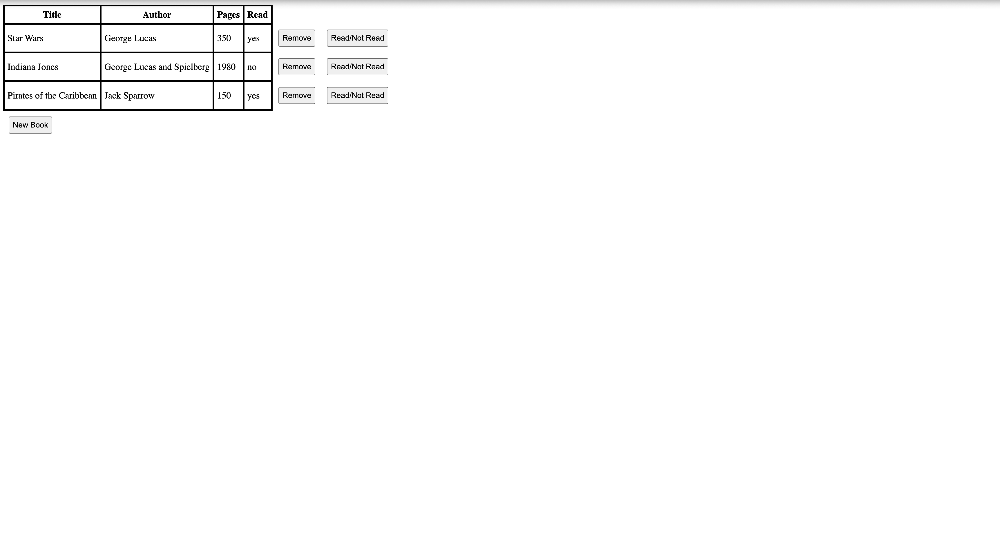

# Object Library
A browser-based book library app built with HTML, CSS, and JavaScript for The Odin Project's Full Stack Developer curriculum (Objects and Object Constructors lesson).

**[Live Demo](https://anthonyc20b.github.io/object-library/)**

---
## Screenshot


---
## Features
- Add books through a modal form (title, author, pages, read status)
- Remove books from the library
- Toggle a book's read status
- Dynamic table rendering driven entirely by the underlying data array
- Each book has a stable, unique ID (via `crypto.randomUUID()`) independent of its position in the array
- Desktop-focused build — functionality practice over visual design

---
## Built With
- HTML5
- CSS3
- JavaScript (Vanilla)

---
## What I Learned
This project was really about getting comfortable with **object constructors and prototypes** — using `new.target` to enforce proper instantiation, and attaching shared behavior like `toggleRead()` to every book instance through the prototype instead of duplicating logic.

The bigger lesson was treating data and display as separate concerns. The array of book objects is the main source, and the table is just a reflection of it, rebuilt with `replaceChildren()` whenever something changes. Getting DOM elements to reliably link back to their corresponding data was tricky at first, using `data-id` attributes tied to each book's `id` ended up connecting most features, from removing a book to toggling its read status.

---
## Running locally
Clone the repo and open `index.html` in a browser:
```bash
git clone git@github.com:anthonyc20b/object-library.git
```
Or just use the [live demo](https://anthonyc20b.github.io/object-library/).